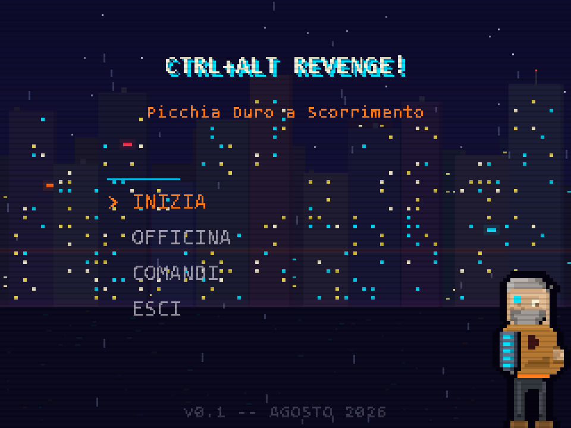
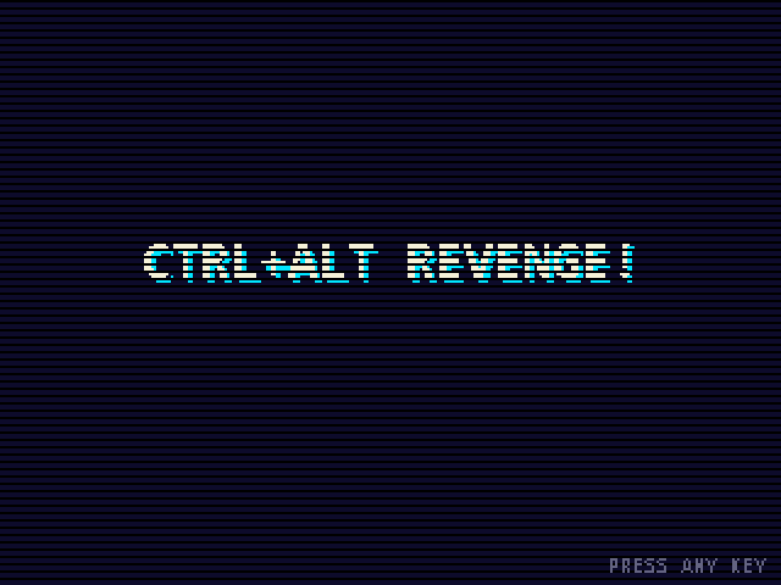
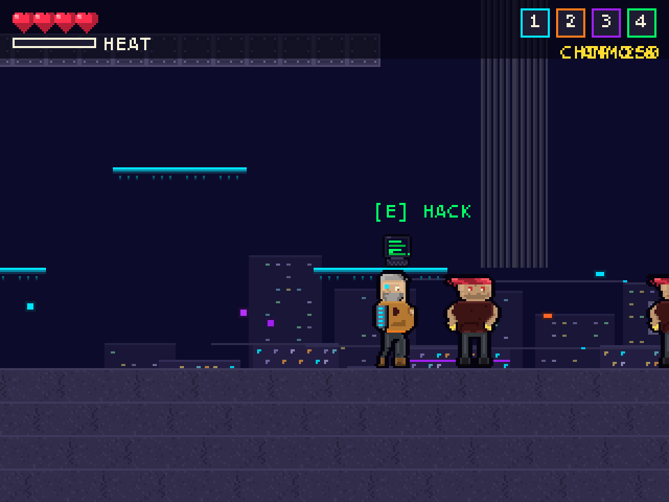
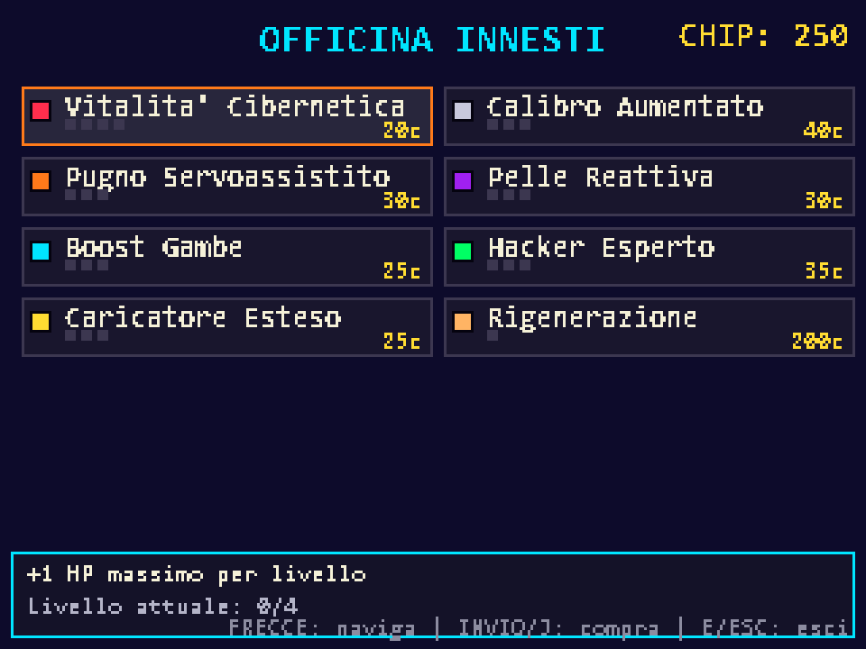
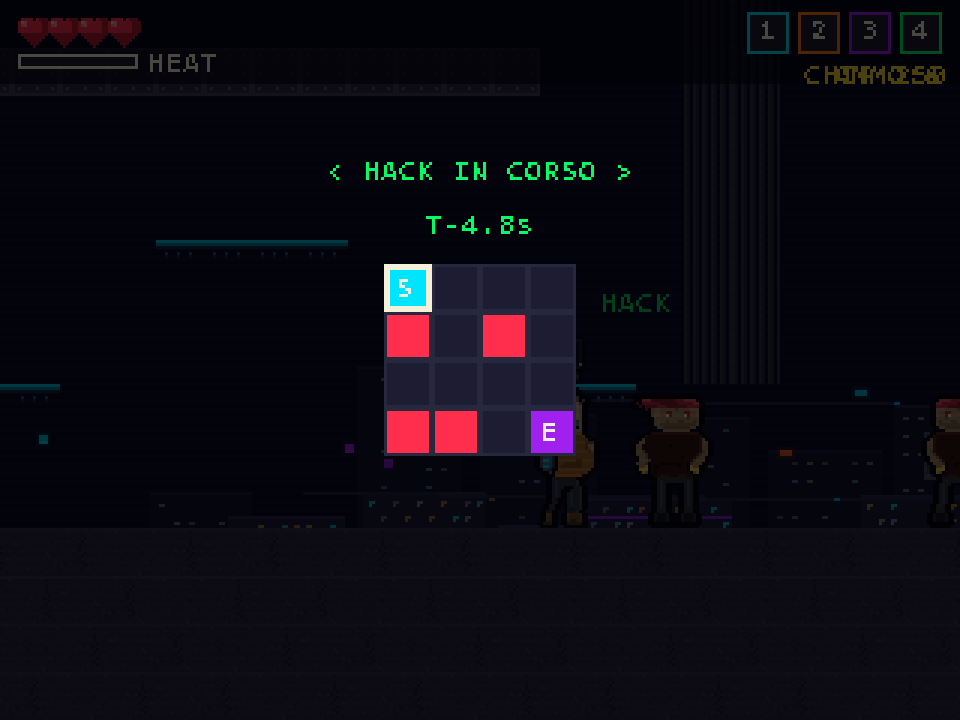
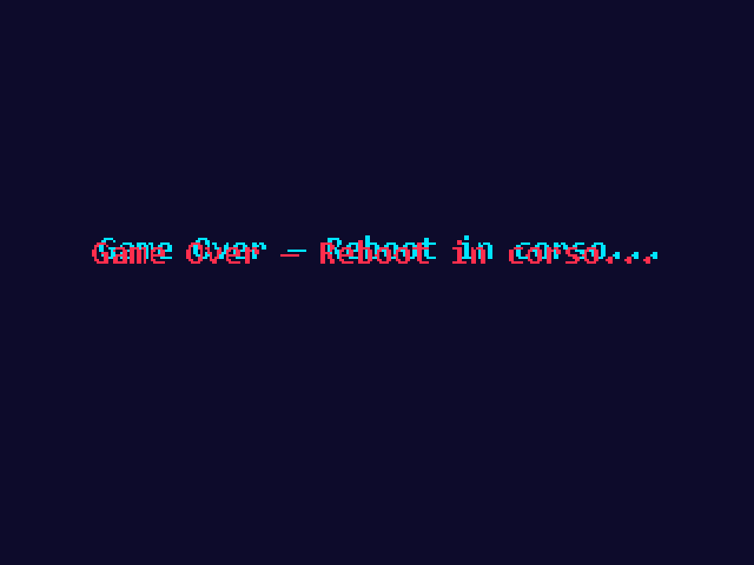
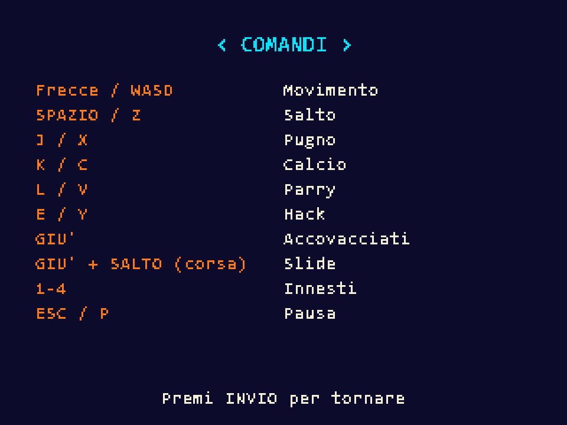
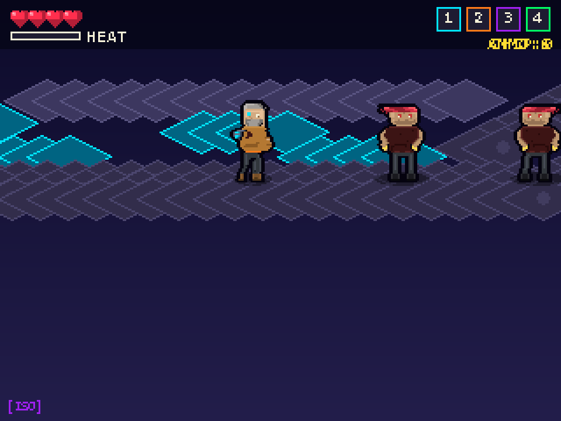

<div align="center">



# CTRL+ALT REVENGE!

### *Picchia Duro a Scorrimento*

**Action beat'em-up cyberpunk in pixel-art, scritto in puro Python + Pygame-CE.**

[](https://www.python.org/)
[](https://pyga.me/)
[](#installazione)
[](#porting-su-altre-piattaforme)
[](pico8/)
[](LICENSE)

[**🎮 Scarica l'eseguibile**](dist/CTRL_ALT_REVENGE.exe) •
[**📜 Storia**](#storia) •
[**🎯 Gameplay**](#gameplay) •
[**🛠️ Sviluppo**](#sviluppo)

</div>

---

## ⚡ Cosa hanno detto i critici (immaginari)

> *"Sembra Streets of Rage che incontra Katana ZERO in un vicolo buio del 2087."*
> — *Cyber Pixel Weekly*

> *"L'occhio cyan di GIG mi guarda anche quando spengo il monitor."*
> — *Reddit user `/u/glitchedneural`*

---

## 🌃 Storia

**Anno 2087.** I megacorp hanno mangiato la città. I cyborg sono tornati a farsi martello.

Tu sei **GIG** — ex-ingegnere, ex-padre, ex-uomo intero. Ti hanno rubato tutto:
la famiglia, la memoria, il braccio sinistro. In cambio ti hanno dato un occhio cyan
che vede troppo e un protocollo neurale che parla quando dovrebbe tacere.

Oggi riprendi il conto. **Sotto la Linea**, dove i Warden v2.0 fanno la guardia
ai server delle megacorporation, c'è qualcuno che ha le tue risposte.
Ha anche le tue costole, se le vuoi.

---

## 🎬 Galleria

<table>
  <tr>
    <td align="center"><b>Intro Animata</b><br>
      
    </td>
    <td align="center"><b>Gameplay</b><br>
      
    </td>
  </tr>
  <tr>
    <td align="center"><b>Officina Innesti</b><br>
      
    </td>
    <td align="center"><b>Hacking Minigame</b><br>
      
    </td>
  </tr>
  <tr>
    <td align="center"><b>Boss Fight</b><br>
      
    </td>
    <td align="center"><b>Comandi</b><br>
      
    </td>
  </tr>
  <tr>
    <td colspan="2" align="center"><b>🎲 Modalità Isometrica (toggle F1)</b><br>
      <br>
      <i>Stesso gioco, visuale fake-3D con tile a diamante e ombre proiettate.</i>
    </td>
  </tr>
</table>

---

## 🎮 Gameplay

### Personaggio

**GIG** — 50enne con barba grigia, giacca marrone e **braccio cyber sinistro**
con segmenti glow ciano. Occhio implant 2x2 brillante.

### Meccaniche

| Categoria | Funzionalità |
|-----------|--------------|
| **Movimento** | Corsa, salto variabile, doppio salto, wall-slide, wall-jump, slide, crouch |
| **Combat** | Pugno (combo 3 colpi), calcio, parry, knockback, hitstop su impatto |
| **Armi** | Pistola con munizioni limitate, ricariche raccoglibili, danno 2 |
| **Hacking** | Mini-gioco griglia 4x4: traccia un percorso evitando i nodi rossi |
| **Innesti** | Visione termica, EMP, bullet-time, doppio salto servoassistito |
| **Stealth** | Coperture, cono visivo nemici, telecamere |

### 🛠️ Officina Innesti

Sistema di **potenziamenti persistenti** acquistabili con `CHIP` droppati dai nemici:

| Perk | Effetto | Livelli | Costo |
|------|---------|:------:|------:|
| 🔴 **Vitalità Cibernetica** | +1 HP max | 4 | 20→150c |
| 🟠 **Pugno Servoassistito** | +1 danno pugno | 3 | 30→150c |
| 🔵 **Boost Gambe** | +10% velocità | 3 | 25→120c |
| 🟡 **Caricatore Esteso** | +4 ammo max | 3 | 25→100c |
| ⚪ **Calibro Aumentato** | +1 danno proiettile | 3 | 40→180c |
| 🟣 **Pelle Reattiva** | +10 i-frame | 3 | 30→100c |
| 🟢 **Hacker Esperto** | +1s hack timer | 3 | 35→140c |
| 🍑 **Rigenerazione** | +1 HP / 8s fuori combat | 1 | 200c |

I CHIP si guadagnano: **Thug = 5** • **Drone = 8** • **Boss = 50**

### 👾 Nemici

| Nemico | HP | AI Behaviors |
|--------|:--:|--------------|
| **Thug** | 3 | Pattuglia, alert, chase, dodge (30%), block (20%), combo (50%), flank |
| **Drone** | 2 | Volo sinusoidale, laser telegrafato, strafe, retreat low-HP, dive bomb |
| **Warden** (Boss) | 20 | 3 fasi: melee, shockwave, spawn drones, enraged finale |

### 🌗 Difficoltà

| Modalità | HP Player | Danno Nemici | Velocità Nemici | Timer Hack | Parry Window |
|----------|:---:|:---:|:---:|:---:|:---:|
| **FACILE** | 6 | ×0.5 | ×0.8 | 8.0s | 12f |
| **NORMALE** | 4 | ×1.0 | ×1.0 | 5.0s | 8f |
| **DIFFICILE** | 3 | ×1.5 | ×1.3 | 3.5s | 6f |

---

## 🕹️ Controlli

### Tastiera

```
  FRECCE / WASD ............... Movimento
  SPAZIO / Z .................. Salto (premi 2x in aria per doppio salto)
  GIÙ + SALTO (in corsa) ...... Slide
  J / X ....................... Pugno  (combo: 3 colpi)
  K / C ....................... Calcio
  L / V ....................... Parry (timing-based, riflette i colpi)
  E / Y ....................... Hack / Sparo (gun se lontano da terminale)
  1, 2, 3, 4 .................. Innesti rapidi
  F1 .......................... Toggle modalità isometrica
  ESC / P ..................... Pausa
```

### Gamepad (Xbox layout)

```
  D-Pad / Stick sx ............ Movimento
  A ........................... Salto
  X ........................... Pugno
  Y ........................... Calcio
  B ........................... Hack / Sparo
  LB .......................... Parry
  LT / RT ..................... Innesti 1 / 2
  START ....................... Pausa
```

---

## 💾 Installazione

### 🚀 Eseguibile pronto (Windows)

Scarica **[`dist/CTRL_ALT_REVENGE.exe`](dist/CTRL_ALT_REVENGE.exe)** (14 MB, self-contained).
Doppio click. Nessuna installazione, nessuna dipendenza.

### 🐍 Da sorgenti (cross-platform)

```bash
# Clone
git clone https://github.com/luigismith/ctrl-alt-revenge.git
cd ctrl-alt-revenge

# Setup (richiede Python 3.11+)
pip install pygame-ce

# Avvia
python main.py
```

### 🛠️ Build eseguibile

```bash
pip install pyinstaller
pyinstaller --onefile --noconsole \
  --name "CTRL_ALT_REVENGE" \
  --add-data "ctrl_alt_revenge/data;ctrl_alt_revenge/data" \
  main.py
```

---

## 🎵 Audio

Tutta la musica e gli effetti sono **generati proceduralmente a runtime** —
zero file audio nel repo:

- **Menu**: pad ambient con arpeggio Am-F-C-G (75 BPM)
- **Livello**: drive synthwave Em-C-G-D + drum kit (120 BPM)
- **Boss**: aggressivo Am-E-Am-F double-time (140 BPM)
- **SFX**: 7 suoni (pugno, salto, danno, hack ok/fail, parry, menu select)
- Sintesi: pulse wave 25% duty, triangle wave, chorus saw (detuned), drum kit con ADSR

---

## 🗺️ Livelli

| # | Nome | Tema | Tile | Nemici |
|:-:|------|------|------|--------|
| **1** | *Sotto la Linea* | Zona C-7 sotterranea | 130×30 | 5 thug, 3 drone, 1 boss |
| **2** | *La Rete* | Server farm sotterranea | 150×35 | 4 thug, 4 drone, 1 boss |
| **3** | *Il Tetto del Mondo* | Tetti di notte | 180×40 | 2 thug, 6 drone, 1 boss |

---

## 📁 Struttura del progetto

```
ctrlaltrevenge/
├── main.py                          # Entry point
├── ctrl_alt_revenge/
│   ├── settings.py                  # Costanti, palette, input map
│   ├── core/
│   │   ├── sprite_generator.py      # Entry per generare sprite
│   │   ├── sprite_matrix.py         # GIG matrix sprites (ASCII art)
│   │   ├── thug_matrix.py           # Thug matrix sprites
│   │   ├── drone_matrix.py          # Drone matrix sprites
│   │   ├── warden_matrix.py         # Warden boss matrix sprites
│   │   ├── camera.py                # Camera 2D con lerp
│   │   ├── input.py                 # Tastiera + gamepad (D-pad, triggers, rumble)
│   │   ├── assets.py                # Asset loader con cache
│   │   ├── state_machine.py         # FSM per stati di gioco
│   │   └── pixel_font.py            # Font bitmap
│   ├── entities/
│   │   ├── entity.py                # Classe base
│   │   ├── player.py                # GIG (parkour, combat, gun, hack)
│   │   ├── enemy.py                 # Base nemico
│   │   ├── components.py            # Mixin: Health, Hitbox, Hurtbox, AI, Hackable
│   │   └── enemies/
│   │       ├── thug.py              # AI: dodge/block/combo/flank
│   │       ├── drone.py             # AI: strafe/retreat/dive bomb
│   │       └── boss_warden.py       # Boss 3 fasi
│   ├── systems/
│   │   ├── physics.py               # AABB collision, ground probe
│   │   ├── combat.py                # Hitbox/hurtbox + parry + hitstop
│   │   ├── hacking.py               # Mini-gioco griglia 4x4
│   │   ├── implants.py              # 4 innesti modulari
│   │   ├── dialog.py                # Dialoghi a scelta multipla
│   │   ├── audio.py                 # Sintesi audio procedurale
│   │   └── perks.py                 # Sistema potenziamenti + CHIP
│   ├── ui/
│   │   ├── intro.py                 # Cutscene intro animata
│   │   ├── menu.py                  # Menu, pausa, game over, level complete
│   │   ├── hud.py                   # Cuori, heat, ammo, CHIP
│   │   └── dialog_box.py            # Box dialogo con ritratto e typewriter
│   └── data/
│       ├── levels/
│       │   ├── level_01.py          # Sotto la Linea (130×30)
│       │   ├── level_02.py          # La Rete (150×35)
│       │   └── level_03.py          # Il Tetto del Mondo (180×40)
│       └── dialogs/
│           └── level_*_dialogs.py
├── gbc/                             # Game Boy Color port (GBDK-2020)
│   ├── src/main.c
│   ├── res/{sprites,tiles,palettes}.h
│   └── build/CTRL_ALT_REVENGE.gbc   # ROM 32KB
├── tools/
│   ├── sprite_studio.py             # Sprite analysis & validation tool
│   └── output/                      # Sprite sheets, palette analysis
├── docs/
│   └── screenshots/                 # README screenshots
└── dist/
    └── CTRL_ALT_REVENGE.exe         # Eseguibile Windows (14 MB)
```

---

## 🕹️ Porting su altre piattaforme

### Game Boy Color

Una versione ridotta del gioco gira su **hardware Game Boy Color reale**!

- **ROM**: [`gbc/build/CTRL_ALT_REVENGE.gbc`](gbc/build/CTRL_ALT_REVENGE.gbc) (32 KB)
- **Risoluzione**: 160×144 pixel
- **Compilato con**: [GBDK-2020](https://github.com/gbdk-2020/gbdk-2020)
- **Funziona su**: BGB, mGBA, Gambatte, flashcart EverDrive GB/GBA

### PICO-8 ISO Edition 🎲

**Port completo fake-3D isometrico** per la fantasy console PICO-8.

- **Cart**: [`pico8/ctrl_alt_revenge.p8`](pico8/ctrl_alt_revenge.p8) (~32 KB)
- **Risoluzione**: 128×128 pixel, 16 colori
- **Visuale**: isometrica top-down (8 direzioni, niente gravità)
- **Engine**: PICO-8 (Lua)
- **Vedi**: [`pico8/README.md`](pico8/README.md) per dettagli e istruzioni

Carica con `LOAD CTRL_ALT_REVENGE` dentro PICO-8, oppure usa PICO-8 EDU online.

---

## 🎨 Art Style

- **Risoluzione interna**: 320×240 (4:3) scalata ×3 a 960×720
- **Sprite size**: scala Golden Axe / Cadillacs & Dinosaurs (GIG 32×48, boss 48×64)
- **Palette**: cyberpunk neon — #0d0b2b notte, #00e5ff cyan, #a020f0 viola, #ff7a1a arancione, #ff2e4d rosso
- **Sistema**: ASCII matrix per ogni sprite (pixel-by-pixel definito come stringhe)
- **Rendering**: outline 1px nero, shading 3-4 toni, dithering selettivo, scanline CRT overlay

---

## 🛠️ Sviluppo

### Tool integrati

- **Sprite Studio** (`tools/sprite_studio.py`): valida tutti gli sprite (dimensioni
  uniformi, outline, trasparenza), esporta sprite sheet a zoom 12×, analisi palette.

```bash
python tools/sprite_studio.py
# Outputs in tools/output/
```

### Tech Stack

```
Lingua          : Python 3.11+
Engine          : Pygame-CE 2.5.7 (SDL2)
Risoluzione     : 320×240 (interno) → 960×720 (scalato ×3)
Frame rate      : 60 FPS (locked)
Audio           : 22050 Hz mono 16-bit, generato a runtime (zero file)
Build           : PyInstaller --onefile (14 MB self-contained)
Port retrò      : GBDK-2020 (Game Boy Color C compiler)
```

### Architettura

- **FSM stati**: `intro → menu → workshop / controls / play → pause / hack / dialog / game_over / level_complete`
- **Component-based entities**: Health, Hitbox, Hurtbox, AI, Hackable mixins
- **Procedural everything**: sprite, palette, tile, background, audio, livelli — tutto generato in codice

---

## 📜 Licenza

MIT License. Copia, modifica, vendi, abbraccia, restituisci.

---

<div align="center">

**Built with ☕, vendetta cibernetica, e troppi caffè.**

*Generated with [Claude Code](https://claude.com/claude-code)*

</div>
